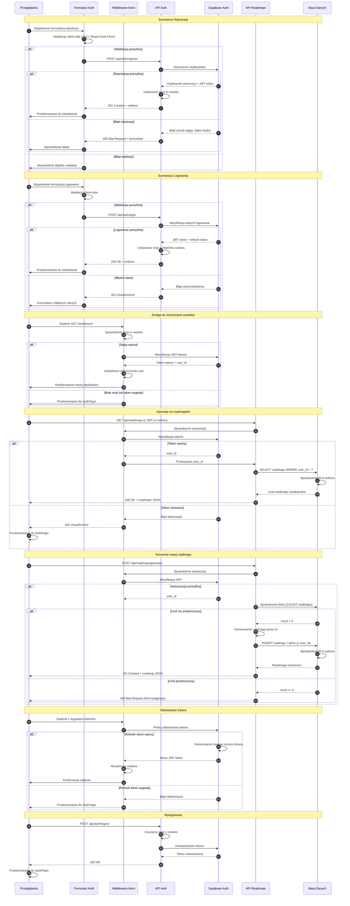

```mermaid
sequenceDiagram
    autonumber
    
    participant Browser as Przeglądarka
    participant AuthForm as Formularz Auth
    participant Middleware as Middleware Astro
    participant AuthAPI as API Auth
    participant SupabaseAuth as Supabase Auth
    participant RoadmapAPI as API Roadmaps
    participant Database as Baza Danych
    
    Note over Browser,Database: Scenariusz Rejestracji
    
    Browser->>AuthForm: Wypełnienie formularza rejestracji
    AuthForm->>AuthForm: Walidacja client-side (Zod + React Hook Form)
    
    alt Walidacja pomyślna
        AuthForm->>AuthAPI: POST /api/auth/register
        AuthAPI->>SupabaseAuth: Utworzenie użytkownika
        
        alt Rejestracja pomyślna
            SupabaseAuth-->>AuthAPI: Użytkownik utworzony + JWT token
            AuthAPI->>AuthAPI: Ustawienie sesji w cookies
            AuthAPI-->>AuthForm: 201 Created + redirect
            AuthForm->>Browser: Przekierowanie do /dashboard
        else Błąd rejestracji
            SupabaseAuth-->>AuthAPI: Błąd (email zajęty, słabe hasło)
            AuthAPI-->>AuthForm: 400 Bad Request + komunikat
            AuthForm->>Browser: Wyświetlenie błędu
        end
    else Błąd walidacji
        AuthForm->>Browser: Wyświetlenie błędów walidacji
    end
    
    Note over Browser,Database: Scenariusz Logowania
    
    Browser->>AuthForm: Wypełnienie formularza logowania
    AuthForm->>AuthForm: Walidacja client-side
    
    alt Walidacja pomyślna
        AuthForm->>AuthAPI: POST /api/auth/login
        AuthAPI->>SupabaseAuth: Weryfikacja danych logowania
        
        alt Logowanie pomyślne
            SupabaseAuth-->>AuthAPI: JWT token + refresh token
            AuthAPI->>AuthAPI: Ustawienie sesji w httpOnly cookies
            AuthAPI-->>AuthForm: 200 OK + redirect
            AuthForm->>Browser: Przekierowanie do /dashboard
        else Błędne dane
            SupabaseAuth-->>AuthAPI: Błąd uwierzytelnienia
            AuthAPI-->>AuthForm: 401 Unauthorized
            AuthForm->>Browser: Komunikat o błędnych danych
        end
    end
    
    Note over Browser,Database: Dostęp do chronionych zasobów
    
    Browser->>Middleware: Żądanie GET /dashboard
    Middleware->>Middleware: Sprawdzenie sesji w cookies
    
    alt Sesja ważna
        Middleware->>SupabaseAuth: Weryfikacja JWT tokenu
        SupabaseAuth-->>Middleware: Token ważny + user_id
        Middleware->>Middleware: Ustawienie context.locals.user
        Middleware->>Browser: Renderowanie strony dashboard
    else Brak sesji lub token wygasły
        Middleware->>Browser: Przekierowanie do /auth/login
    end
    
    Note over Browser,Database: Operacje na roadmapach
    
    Browser->>RoadmapAPI: GET /api/roadmaps (z JWT w cookies)
    RoadmapAPI->>Middleware: Sprawdzenie autoryzacji
    Middleware->>SupabaseAuth: Weryfikacja tokenu
    
    alt Token ważny
        SupabaseAuth-->>Middleware: user_id
        Middleware->>RoadmapAPI: Przekazanie user_id
        RoadmapAPI->>Database: SELECT roadmaps WHERE user_id = ?
        Database->>Database: Sprawdzenie RLS policies
        Database-->>RoadmapAPI: Lista roadmaps użytkownika
        RoadmapAPI-->>Browser: 200 OK + roadmaps JSON
    else Token nieważny
        SupabaseAuth-->>Middleware: Błąd autoryzacji
        Middleware-->>Browser: 401 Unauthorized
        Browser->>Browser: Przekierowanie do /auth/login
    end
    
    Note over Browser,Database: Tworzenie nowej roadmapy
    
    Browser->>RoadmapAPI: POST /api/roadmaps/generate
    RoadmapAPI->>Middleware: Sprawdzenie autoryzacji
    Middleware->>SupabaseAuth: Weryfikacja JWT
    
    alt Autoryzacja pomyślna
        SupabaseAuth-->>Middleware: user_id
        RoadmapAPI->>Database: Sprawdzenie limitu (COUNT roadmaps)
        
        alt Limit nie przekroczony
            Database-->>RoadmapAPI: count < 5
            RoadmapAPI->>RoadmapAPI: Generowanie roadmapy przez AI
            RoadmapAPI->>Database: INSERT roadmap + items (z user_id)
            Database->>Database: Sprawdzenie RLS policies
            Database-->>RoadmapAPI: Roadmapa utworzona
            RoadmapAPI-->>Browser: 201 Created + roadmap JSON
        else Limit przekroczony
            Database-->>RoadmapAPI: count >= 5
            RoadmapAPI-->>Browser: 400 Bad Request (limit osiągnięty)
        end
    end
    
    Note over Browser,Database: Odświeżanie tokenu
    
    Browser->>Middleware: Żądanie z wygasłym tokenem
    Middleware->>SupabaseAuth: Próba odświeżenia tokenu
    
    alt Refresh token ważny
        SupabaseAuth->>SupabaseAuth: Generowanie nowego access tokenu
        SupabaseAuth-->>Middleware: Nowy JWT token
        Middleware->>Middleware: Aktualizacja cookies
        Middleware->>Browser: Kontynuacja żądania
    else Refresh token wygasły
        SupabaseAuth-->>Middleware: Błąd odświeżania
        Middleware-->>Browser: Przekierowanie do /auth/login
    end
    
    Note over Browser,Database: Wylogowanie
    
    Browser->>AuthAPI: POST /api/auth/logout
    AuthAPI->>AuthAPI: Usunięcie sesji z cookies
    AuthAPI->>SupabaseAuth: Unieważnienie tokenu
    SupabaseAuth-->>AuthAPI: Token unieważniony
    AuthAPI-->>Browser: 200 OK
    Browser->>Browser: Przekierowanie do /auth/login
```