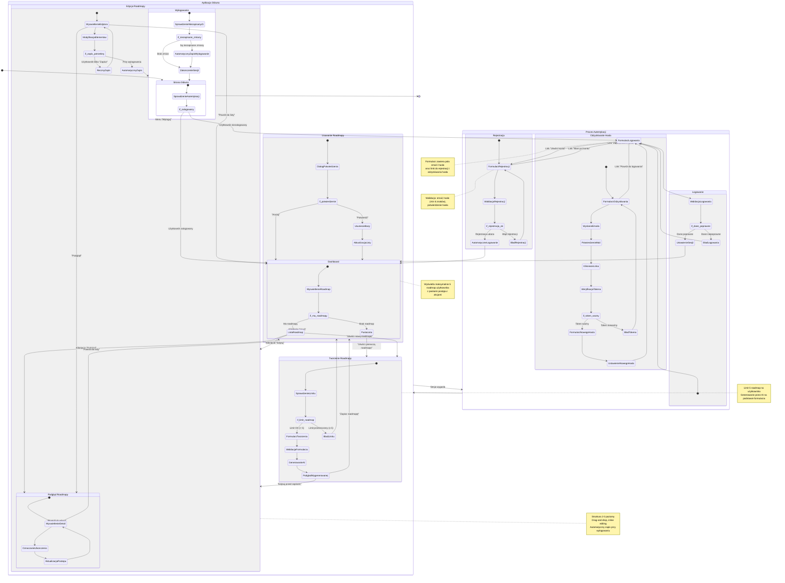

```mermaid
stateDiagram-v2
    [*] --> StronaGlowna
    
    state "Strona Główna" as StronaGlowna {
        [*] --> SprawdzenieAutentykacji
        SprawdzenieAutentykacji --> if_zalogowany
        
        state if_zalogowany <<choice>>
        if_zalogowany --> Dashboard: Użytkownik zalogowany
        if_zalogowany --> FormularzLogowania: Użytkownik niezalogowany
    }
    
    state "Proces Autentykacji" as Autentykacja {
        state "Logowanie" as Logowanie {
            [*] --> FormularzLogowania
            FormularzLogowania --> WalidacjaLogowania
            WalidacjaLogowania --> if_dane_poprawne
            
            state if_dane_poprawne <<choice>>
            if_dane_poprawne --> UstawienieSesjii: Dane poprawne
            if_dane_poprawne --> BladLogowania: Dane niepoprawne
            
            BladLogowania --> FormularzLogowania
            UstawienieSesjii --> Dashboard
            
            FormularzLogowania --> FormularzRejestracji: Link "Utwórz konto"
            FormularzLogowania --> OdzyskiwanieHasla: Link "Zapomniałem hasła"
        }
        
        state "Rejestracja" as Rejestracja {
            [*] --> FormularzRejestracji
            FormularzRejestracji --> WalidacjaRejestracji
            WalidacjaRejestracji --> if_rejestracja_ok
            
            state if_rejestracja_ok <<choice>>
            if_rejestracja_ok --> AutomatyczneLogowanie: Rejestracja udana
            if_rejestracja_ok --> BladRejestracji: Błąd rejestracji
            
            BladRejestracji --> FormularzRejestracji
            AutomatyczneLogowanie --> Dashboard
            
            FormularzRejestracji --> FormularzLogowania: Link "Mam już konto"
        }
        
        state "Odzyskiwanie Hasła" as OdzyskiwanieHasla {
            [*] --> FormularzOdzyskiwania
            FormularzOdzyskiwania --> WyslanieEmaila
            WyslanieEmaila --> PotwierdzenieMail
            PotwierdzenieMail --> KlikniecieLinka
            KlikniecieLinka --> WeryfikacjaTokena
            
            WeryfikacjaTokena --> if_token_wazny
            state if_token_wazny <<choice>>
            if_token_wazny --> FormularzNowegoHasla: Token ważny
            if_token_wazny --> BladTokena: Token nieważny
            
            FormularzNowegoHasla --> UstawienieNowegoHasla
            UstawienieNowegoHasla --> FormularzLogowania
            BladTokena --> FormularzOdzyskiwania
            
            FormularzOdzyskiwania --> FormularzLogowania: Link "Powrót do logowania"
        }
    }
    
    state "Aplikacja Główna" as AplikacjaGlowna {
        state "Dashboard" as Dashboard {
            [*] --> WyswietlenieRoadmap
            WyswietlenieRoadmap --> if_ma_roadmapy
            
            state if_ma_roadmapy <<choice>>
            if_ma_roadmapy --> ListaRoadmap: Ma roadmapy
            if_ma_roadmapy --> PustaLista: Brak roadmap
            
            PustaLista --> TworzenieRoadmapy: "Utwórz pierwszą roadmapę"
            ListaRoadmap --> TworzenieRoadmapy: "Utwórz nową roadmapę"
            ListaRoadmap --> PodgladRoadmapy: Kliknięcie "Podgląd"
            ListaRoadmap --> EdycjaRoadmapy: Kliknięcie "Edytuj"
            ListaRoadmap --> UsuwanieRoadmapy: Kliknięcie "Usuń"
        }
        
        state "Tworzenie Roadmapy" as TworzenieRoadmapy {
            [*] --> SprawdzenieLimitu
            SprawdzenieLimitu --> if_limit_roadmap
            
            state if_limit_roadmap <<choice>>
            if_limit_roadmap --> FormularzTworzenia: Limit OK (< 5)
            if_limit_roadmap --> BladLimitu: Limit przekroczony (≥ 5)
            
            BladLimitu --> Dashboard
            FormularzTworzenia --> WalidacjaFormularza
            WalidacjaFormularza --> GenerowanieAI
            GenerowanieAI --> PodgladWygenerowanej
            PodgladWygenerowanej --> Dashboard: "Zapisz roadmapę"
            PodgladWygenerowanej --> EdycjaRoadmapy: "Edytuj przed zapisem"
        }
        
        state "Podgląd Roadmapy" as PodgladRoadmapy {
            [*] --> WyswietlenieDetali
            WyswietlenieDetali --> OznaczanieUkonczenia
            OznaczanieUkonczenia --> AktualizacjaPostepu
            AktualizacjaPostepu --> WyswietlenieDetali
            
            WyswietlenieDetali --> EdycjaRoadmapy: "Przejdź do edycji"
            WyswietlenieDetali --> Dashboard: "Powrót do listy"
        }
        
        state "Edycja Roadmapy" as EdycjaRoadmapy {
            [*] --> WyswietlenieEdytora
            WyswietlenieEdytora --> ModyfikacjaElementow
            ModyfikacjaElementow --> if_zapis_potrzebny
            
            state if_zapis_potrzebny <<choice>>
            if_zapis_potrzebny --> RecznyZapis: Użytkownik klika "Zapisz"
            if_zapis_potrzebny --> AutomatycznyZapis: Przy wylogowaniu
            
            RecznyZapis --> WyswietlenieEdytora
            AutomatycznyZapis --> Wylogowanie
            
            WyswietlenieEdytora --> PodgladRoadmapy: "Podgląd"
            WyswietlenieEdytora --> Dashboard: "Powrót do listy"
        }
        
        state "Usuwanie Roadmapy" as UsuwanieRoadmapy {
            [*] --> DialogPotwierdzenia
            DialogPotwierdzenia --> if_potwierdzenie
            
            state if_potwierdzenie <<choice>>
            if_potwierdzenie --> UsuniecieBazy: "Potwierdź"
            if_potwierdzenie --> Dashboard: "Anuluj"
            
            UsuniecieBazy --> AktualizacjaListy
            AktualizacjaListy --> Dashboard
        }
    }
    
    state "Wylogowanie" as Wylogowanie {
        [*] --> SprawdzenieNiezapisanych
        SprawdzenieNiezapisanych --> if_niezapisane_zmiany
        
        state if_niezapisane_zmiany <<choice>>
        if_niezapisane_zmiany --> AutomatycznyZapisWylogowanie: Są niezapisane zmiany
        if_niezapisane_zmiany --> ZakonczenieSesjii: Brak zmian
        
        AutomatycznyZapisWylogowanie --> ZakonczenieSesjii
        ZakonczenieSesjii --> StronaGlowna
    }
    
    %% Przejścia między głównymi stanami
    Autentykacja --> AplikacjaGlowna
    AplikacjaGlowna --> Wylogowanie: Menu "Wyloguj"
    AplikacjaGlowna --> Autentykacja: Sesja wygasła
    
    %% Stany końcowe
    Wylogowanie --> [*]
    
    %% Notatki
    note right of FormularzLogowania
        Formularz zawiera pola email i hasło
        oraz linki do rejestracji i odzyskiwania hasła
    end note
    
    note right of FormularzRejestracji
        Walidacja: email, hasło (min 6 znaków),
        potwierdzenie hasła
    end note
    
    note right of Dashboard
        Wyświetla maksymalnie 5 roadmap użytkownika
        z paskami postępu i akcjami
    end note
    
    note right of TworzenieRoadmapy
        Limit 5 roadmap na użytkownika
        Generowanie przez AI na podstawie formularza
    end note
    
    note right of EdycjaRoadmapy
        Struktura 2-3 poziomy
        Drag-and-drop, inline editing
        Automatyczny zapis przy wylogowaniu
    end note
```