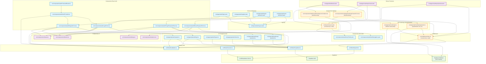

```mermaid
flowchart TD
    %% Strony Autentykacji
    subgraph "Strony Autentykacji"
        LoginPage["src/pages/auth/login.astro"]
        RegisterPage["src/pages/auth/register.astro"]
        ForgotPage["src/pages/auth/forgot-password.astro"]
        ResetPage["src/pages/auth/reset-password.astro"]
    end

    %% Layouty
    subgraph "Layouty"
        AuthLayout["src/layouts/AuthLayout.astro"]
        MainLayout["src/layouts/Layout.astro<br/>(rozszerzony o auth)"]
    end

    %% Komponenty React Auth
    subgraph "Komponenty React Auth"
        LoginForm["src/components/auth/LoginForm.tsx"]
        RegisterForm["src/components/auth/RegisterForm.tsx"]
        ForgotForm["src/components/auth/ForgotPasswordForm.tsx"]
        ResetForm["src/components/auth/ResetPasswordForm.tsx"]
        AuthProvider["src/components/auth/AuthProvider.tsx"]
        ProtectedRoute["src/components/auth/ProtectedRoute.tsx"]
    end

    %% Komponenty Astro Auth
    subgraph "Komponenty Astro Auth"
        AuthNav["src/components/auth/AuthNavigation.astro"]
        UserProfile["src/components/auth/UserProfile.astro"]
    end

    %% API Endpoints Auth
    subgraph "API Endpoints Auth"
        LoginAPI["src/pages/api/auth/login.ts"]
        RegisterAPI["src/pages/api/auth/register.ts"]
        LogoutAPI["src/pages/api/auth/logout.ts"]
        RefreshAPI["src/pages/api/auth/refresh.ts"]
        ForgotAPI["src/pages/api/auth/forgot-password.ts"]
        ResetAPI["src/pages/api/auth/reset-password.ts"]
    end

    %% Serwisy Auth
    subgraph "Serwisy Auth"
        AuthService["src/lib/auth/supabase.ts"]
        SessionService["src/lib/auth/session.ts"]
        AuthGuards["src/lib/auth/guards.ts"]
        AuthValidation["src/lib/auth/validation.ts"]
    end

    %% Middleware
    subgraph "Middleware"
        AuthMiddleware["src/middleware/index.ts<br/>(rozszerzony o auth)"]
    end

    %% Strony Chronione
    subgraph "Strony Chronione"
        Dashboard["src/pages/dashboard.astro"]
        CreateRoadmap["src/pages/roadmaps/create.astro"]
        PreviewRoadmap["src/pages/roadmaps/preview.astro"]
    end

    %% Komponenty Aplikacji (aktualizowane)
    subgraph "Komponenty Aplikacji"
        RoadmapList["src/components/dashboard/RoadmapListContainer.tsx<br/>(aktualizowany)"]
        RoadmapForm["src/components/roadmap/RoadmapCreationForm.tsx<br/>(aktualizowany)"]
    end

    %% API Roadmaps (aktualizowane)
    subgraph "API Roadmaps (aktualizowane)"
        RoadmapsAPI["src/pages/api/roadmaps.ts<br/>(dodana autoryzacja)"]
        GenerateAPI["src/pages/api/roadmaps/generate.ts<br/>(sprawdzanie user_id)"]
    end

    %% Komponenty UI (Shadcn/ui)
    subgraph "Komponenty UI"
        Button["src/components/ui/button.tsx"]
        Input["src/components/ui/input.tsx"]
        Dialog["src/components/ui/dialog.tsx"]
        Spinner["src/components/ui/spinner.tsx"]
    end

    %% Supabase
    subgraph "Supabase"
        SupabaseAuth["Supabase Auth"]
        SupabaseDB["Supabase Database<br/>(RLS Policies)"]
        SupabaseClient["src/db/supabase.client.ts"]
    end

    %% Połączenia - Strony Auth → Layouty
    LoginPage --> AuthLayout
    RegisterPage --> AuthLayout
    ForgotPage --> AuthLayout
    ResetPage --> AuthLayout

    %% Połączenia - Strony Auth → Komponenty React
    LoginPage --> LoginForm
    RegisterPage --> RegisterForm
    ForgotPage --> ForgotForm
    ResetPage --> ResetForm

    %% Połączenia - Komponenty React → API
    LoginForm --> LoginAPI
    RegisterForm --> RegisterAPI
    ForgotForm --> ForgotAPI
    ResetForm --> ResetAPI

    %% Połączenia - API → Serwisy
    LoginAPI --> AuthService
    RegisterAPI --> AuthService
    LogoutAPI --> AuthService
    RefreshAPI --> AuthService
    ForgotAPI --> AuthService
    ResetAPI --> AuthService

    %% Połączenia - Serwisy → Supabase
    AuthService --> SupabaseAuth
    SessionService --> SupabaseClient
    AuthGuards --> SupabaseClient

    %% Połączenia - Walidacja
    LoginForm --> AuthValidation
    RegisterForm --> AuthValidation
    ForgotForm --> AuthValidation
    ResetForm --> AuthValidation
    LoginAPI --> AuthValidation
    RegisterAPI --> AuthValidation

    %% Połączenia - Middleware
    AuthMiddleware --> SessionService
    AuthMiddleware --> AuthGuards
    Dashboard --> AuthMiddleware
    CreateRoadmap --> AuthMiddleware
    PreviewRoadmap --> AuthMiddleware

    %% Połączenia - Strony Chronione → Layouty
    Dashboard --> MainLayout
    CreateRoadmap --> MainLayout
    PreviewRoadmap --> MainLayout

    %% Połączenia - Layout → Komponenty Auth
    MainLayout --> AuthNav
    MainLayout --> UserProfile

    %% Połączenia - Kontekst Auth
    AuthProvider --> LoginForm
    AuthProvider --> RegisterForm
    AuthProvider --> SessionService
    ProtectedRoute --> AuthProvider

    %% Połączenia - Komponenty Aplikacji
    Dashboard --> RoadmapList
    CreateRoadmap --> RoadmapForm
    RoadmapList --> RoadmapsAPI
    RoadmapForm --> GenerateAPI

    %% Połączenia - API Roadmaps → Auth
    RoadmapsAPI --> AuthMiddleware
    GenerateAPI --> AuthMiddleware
    RoadmapsAPI --> SupabaseDB
    GenerateAPI --> SupabaseDB

    %% Połączenia - UI Components
    LoginForm --> Button
    LoginForm --> Input
    RegisterForm --> Button
    RegisterForm --> Input
    ForgotForm --> Button
    ForgotForm --> Input
    ResetForm --> Button
    ResetForm --> Input
    RoadmapForm --> Spinner
    RoadmapList --> Dialog

    %% Stylizacja węzłów
    classDef newComponent fill:#e1f5fe,stroke:#0277bd,stroke-width:2px
    classDef updatedComponent fill:#fff3e0,stroke:#f57c00,stroke-width:2px
    classDef existingComponent fill:#f3e5f5,stroke:#7b1fa2,stroke-width:2px
    classDef supabaseComponent fill:#e8f5e8,stroke:#2e7d32,stroke-width:2px

    %% Aplikacja stylów
    class LoginPage,RegisterPage,ForgotPage,ResetPage,AuthLayout,LoginForm,RegisterForm,ForgotForm,ResetForm,AuthProvider,ProtectedRoute,AuthNav,UserProfile,LoginAPI,RegisterAPI,LogoutAPI,RefreshAPI,ForgotAPI,ResetAPI,AuthService,SessionService,AuthGuards,AuthValidation newComponent

    class AuthMiddleware,MainLayout,RoadmapList,RoadmapForm,RoadmapsAPI,GenerateAPI updatedComponent

    class Dashboard,CreateRoadmap,PreviewRoadmap,Button,Input,Dialog,Spinner existingComponent

    class SupabaseAuth,SupabaseDB,SupabaseClient supabaseComponent
```