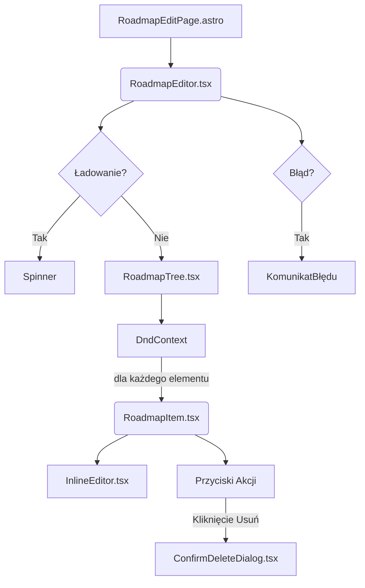

# Plan implementacji widoku: Edycja Roadmapy

## 1. Przegląd

Widok "Edycja Roadmapy" jest kluczowym interfejsem w aplikacji, umożliwiającym użytkownikom modyfikację wygenerowanych przez AI roadmap. Użytkownik może w czasie rzeczywistym dodawać, edytować, usuwać i zmieniać kolejność elementów w obrębie 2-3 poziomowej struktury drzewa. Interfejs wykorzystuje mechanizm inline editing do szybkiej edycji treści oraz drag-and-drop do reorganizacji struktury. Każda zmiana jest natychmiast zapisywana na serwerze, co zapewnia płynność pracy i bezpieczeństwo danych.

**Uwaga:** Wdrożenie będzie odbiegać od wymagania PRD dotyczącego "ręcznego zapisu". Ze względu na atomową naturę dostarczonych punktów końcowych API (każda operacja na pojedynczym elemencie), przyjęto strategię autozapisu. Każda akcja użytkownika (edycja, dodanie, usunięcie, zmiana kolejności) wywołuje natychmiastowe zapytanie do API, co jest zgodne z historyjką użytkownika "Zmiany są widoczne natychmiast w interfejsie" i zapewnia lepsze doświadczenie użytkownika.

## 2. Routing widoku

Widok będzie dostępny pod dynamiczną ścieżką w aplikacji:
- **Ścieżka:** `/roadmaps/:id/edit`
- **Parametry:** `id` (UUID) - identyfikator edytowanej roadmapy.

Strona powinna być komponentem Astro (`.astro`), który renderuje kliencki komponent React (`.tsx`) z opcją `client:load`, aby zapewnić interaktywność natychmiast po załadowaniu strony.

## 3. Struktura komponentów

Hierarchia komponentów React zostanie zorganizowana w celu oddzielenia logiki (containery) od prezentacji (komponenty UI).


- **`RoadmapEditPage.astro`**: Strona Astro, odpowiedzialna za pobranie danych i renderowanie komponentu React.
- **`RoadmapEditor.tsx`**: Główny komponent-kontener React. Zarządza stanem, logiką i wywołaniami API za pomocą hooka `useRoadmapEditor`.
- **`RoadmapTree.tsx`**: Komponent prezentacyjny, który renderuje strukturę drzewa roadmapy i obsługuje logikę drag-and-drop (`dnd-kit`).
- **`RoadmapItem.tsx`**: Komponent prezentacyjny dla pojedynczego elementu w drzewie. Wyświetla jego treść i przyciski akcji.
- **`InlineEditor.tsx`**: Komponent UI do edycji tekstu w miejscu.
- **`ConfirmDeleteDialog.tsx`**: Okno dialogowe Shadcn/ui do potwierdzania operacji usunięcia.

## 4. Szczegóły komponentów

### `RoadmapEditor.tsx`
- **Opis:** Główny kontener widoku. Inicjalizuje dane, zarządza stanem ładowania i błędów, oraz dostarcza dane i funkcje do komponentów podrzędnych.
- **Główne elementy:** `Spinner` (Shadcn/ui), `RoadmapTree`.
- **Obsługiwane zdarzenia:** Brak bezpośrednich interakcji. Logika jest zarządzana przez hook `useRoadmapEditor`.
- **Warunki walidacji:** Sprawdza istnienie danych roadmapy. Jeśli dane nie zostaną załadowane, wyświetla stan błędu lub ładowania.
- **Typy:** `RoadmapDetailsDto`, `RoadmapEditorViewModel`.
- **Propsy:** `initialData: RoadmapDetailsDto`.

### `RoadmapTree.tsx`
- **Opis:** Renderuje rekursywnie listę elementów roadmapy. Otacza listę w `DndContext` z biblioteki `dnd-kit`, aby umożliwić funkcjonalność przeciągnij-i-upuść.
- **Główne elementy:** `DndContext`, `RoadmapItem`.
- **Obsługiwane zdarzenia:** `onDragEnd` - wywoływane po zakończeniu przeciągania elementu.
- **Warunki walidacji:** Brak.
- **Typy:** `RoadmapItemViewModel`.
- **Propsy:** `items: RoadmapItemViewModel[]`, `onReorder: (activeId, overId) => void`, `onUpdate: (...)`, `onDelete: (...)`, `onAdd: (...)`.

### `RoadmapItem.tsx`
- **Opis:** Reprezentuje pojedynczy, potencjalnie zagnieżdżony, element roadmapy. Zawiera tytuł, opis, przyciski akcji (dodaj pod-element, edytuj, usuń) oraz uchwyt do przeciągania.
- **Główne elementy:** `Accordion` (dla rozwijania/zwijania), `Button`, `Dialog` (dla `ConfirmDeleteDialog`), `InlineEditor`.
- **Obsługiwane interakcje:**
  - Kliknięcie przycisku "Edytuj": przełącza `InlineEditor` w tryb edycji.
  - Kliknięcie przycisku "Usuń": otwiera `ConfirmDeleteDialog`.
  - Kliknięcie przycisku "Dodaj": wywołuje funkcję `onAdd` z `parent_item_id` bieżącego elementu.
  - Przeciągnięcie za pomocą uchwytu.
- **Obsługiwana walidacja:** Walidacja edytowanych pól (np. `title`) jest delegowana do `InlineEditor`.
- **Typy:** `RoadmapItemViewModel`, `UpdateRoadmapItemCommand`.
- **Propsy:** `item: RoadmapItemViewModel`, `onUpdate`, `onDelete`, `onAdd`.

### `InlineEditor.tsx`
- **Opis:** Komponent UI, który przełącza się między widokiem tekstowym (`<p>` lub `<div>`) a polem edycyjnym (`<input>` lub `<textarea>`).
- **Główne elementy:** `Input` (Shadcn/ui), `Textarea` (Shadcn/ui), `Button` (do zapisu).
- **Obsługiwane interakcje:** Wejście w tryb edycji, edycja tekstu, zapis (przez kliknięcie przycisku lub naciśnięcie `Enter`), anulowanie (przez `Escape`).
- **Obsługiwana walidacja:**
  - `title` nie może być pusty. Przycisk zapisu jest nieaktywny, jeśli pole jest puste.
- **Typy:** `string`.
- **Propsy:** `value: string`, `onSave: (newValue: string) => void`, `fieldName: string`.

## 5. Typy

Oprócz typów DTO z `src/types.ts` (`RoadmapItemDto`, `CreateRoadmapItemCommand`, `UpdateRoadmapItemCommand`), kluczowy będzie ViewModel po stronie klienta do reprezentacji struktury drzewa.

```typescript
// src/components/roadmap/types.ts

import type { RoadmapItemDto } from "@/types";

/**
 * ViewModel dla pojedynczego elementu roadmapy w drzewie UI.
 * Rozszerza standardowe DTO o tablicę zagnieżdżonych dzieci.
 */
export interface RoadmapItemViewModel extends RoadmapItemDto {
  children: RoadmapItemViewModel[];
}

/**
 * ViewModel dla całego edytora, zawierający zagnieżdżoną strukturę
 * i metadane roadmapy.
 */
export interface RoadmapEditorViewModel {
  id: string;
  title: string;
  // ...pozostałe pola z RoadmapDto
  items: RoadmapItemViewModel[];
}
```

## 6. Zarządzanie stanem

Cała logika biznesowa zostanie zamknięta w customowym hooku `useRoadmapEditor`. Takie podejście upraszcza komponent `RoadmapEditor` i ułatwia testowanie logiki w izolacji.

**`useRoadmapEditor(initialData: RoadmapDetailsDto)`**

- **Stan wewnętrzny:**
  - `flatItems: RoadmapItemDto[]`: Płaska lista elementów, która jest jedynym "źródłem prawdy". Aktualizacje (dodawanie, usuwanie, edycja) operują na tej liście.
  - `isLoading: boolean`: Informuje o stanie operacji API.
  - `error: string | null`: Przechowuje komunikaty o błędach.
- **Stan pochodny (Memoized):**
  - `nestedItems: RoadmapItemViewModel[]`: Zagnieżdżona struktura drzewa, generowana z `flatItems` przy użyciu `useMemo`. Zmiana `flatItems` automatycznie i wydajnie aktualizuje drzewo.
- **Funkcje (Akcje):**
  - `addItem(command: CreateRoadmapItemCommand)`
  - `updateItem(itemId: string, command: UpdateRoadmapItemCommand)`
  - `deleteItem(itemId: string)`
  - `reorderItems(activeId: string, overId: string | null, newIndex: number)`
  
Każda z tych funkcji będzie wykonywać aktualizacje optymistyczne: najpierw modyfikuje stan `flatItems`, a następnie wysyła żądanie do API. W przypadku błędu API, zmiana jest wycofywana, a użytkownik otrzymuje powiadomienie.

## 7. Integracja API

Integracja będzie opierać się na wywołaniach do istniejących endpointów API za pomocą `fetch`.

- **`GET /api/roadmaps/:roadmapId`**
  - **Wywołanie:** Przy inicjalizacji widoku.
  - **Typ odpowiedzi:** `RoadmapDetailsDto`.
- **`POST /api/roadmaps/:roadmapId/items`**
  - **Wywołanie:** Po dodaniu nowego elementu przez użytkownika.
  - **Typ żądania:** `CreateRoadmapItemCommand`.
  - **Typ odpowiedzi:** `RoadmapItemRecordDto`.
- **`PATCH /api/roadmaps/:roadmapId/items/:itemId`**
  - **Wywołanie:** Po edycji pola, zmianie statusu `is_completed`, lub zmianie kolejności.
  - **Typ żądania:** `UpdateRoadmapItemCommand`.
  - **Typ odpowiedzi:** `RoadmapItemRecordDto`.
- **`DELETE /api/roadmaps/:roadmapId/items/:itemId`**
  - **Wywołanie:** Po potwierdzeniu usunięcia elementu.
  - **Typ odpowiedzi:** `204 No Content`.

## 8. Interakcje użytkownika

- **Edycja treści:** Użytkownik klika na tytuł/opis, co aktywuje `InlineEditor`. Zmiany są zapisywane po wciśnięciu `Enter` lub kliknięciu przycisku zapisu.
- **Dodawanie elementu:** Użytkownik klika przycisk "Dodaj" na elemencie nadrzędnym lub główny przycisk "Dodaj rozdział". Nowy element pojawia się natychmiast w trybie edycji.
- **Usuwanie elementu:** Użytkownik klika ikonę kosza. Pojawia się `ConfirmDeleteDialog`. Po potwierdzeniu, element i jego dzieci znikają z interfejsu.
- **Zmiana kolejności:** Użytkownik przeciąga element za pomocą dedykowanego uchwytu i upuszcza go w nowym miejscu (w obrębie tego samego rodzica lub przenosząc do innego). Interfejs natychmiast odzwierciedla nową strukturę.
- **Oznaczanie jako ukończone:** Użytkownik klika `Checkbox` przy elemencie. Stan jest natychmiast zapisywany i odzwierciedlany w UI.

## 9. Warunki i walidacja

Walidacja po stronie klienta jest kluczowa dla dobrego UX i odciążenia serwera.
- **Komponent `InlineEditor`:**
  - **Warunek:** Pole `title` nie może być puste.
  - **Walidacja:** Przycisk zapisu jest nieaktywny (`disabled`), a pod polem pojawia się komunikat, jeśli wartość jest pusta.
- **Logika `useRoadmapEditor`:**
  - **Warunek:** `roadmapId` musi być poprawnym UUID.
  - **Walidacja:** Przed wywołaniem API, strona `.astro` może zweryfikować format `id` z parametru URL i w razie błędu wyświetlić stronę 404.
  - **Warunek:** `level` i `position` muszą być poprawnie obliczone przed wysłaniem żądania `POST` lub `PATCH`.
  - **Walidacja:** To jest wewnętrzna logika biznesowa hooka, nie walidacja danych od użytkownika.

## 10. Obsługa błędów

System obsługi błędów musi być solidny i informatywny dla użytkownika.
- **Błędy sieciowe / 5xx:** Wyświetlenie globalnego powiadomienia (toast) z informacją o problemie z serwerem lub połączeniem. Wszelkie optymistyczne aktualizacje UI muszą zostać wycofane.
- **Błąd 401 (Unauthorized):** Przekierowanie użytkownika na stronę logowania.
- **Błąd 404 (Not Found):** Wyświetlenie dedykowanego komponentu "Nie znaleziono roadmapy".
- **Błąd 400 (Bad Request):** Wyświetlenie powiadomienia (toast) z komunikatem błędu zwróconym przez API (np. "Tytuł nie może być pusty"). Zmiana, która spowodowała błąd, jest wycofywana z UI.

## 11. Kroki implementacji

1.  **Struktura plików:** Utworzyć pliki dla nowych komponentów w `src/components/roadmap/` (`RoadmapEditor.tsx`, `RoadmapTree.tsx`, `RoadmapItem.tsx`, etc.) oraz stronę `src/pages/roadmaps/[id]/edit.astro`.
2.  **Typy i hook:** Zdefiniować typy `ViewModel` i zaimplementować szkielet hooka `useRoadmapEditor` z podstawowym stanem i funkcjami.
3.  **Komponenty UI:** Zaimplementować komponenty `RoadmapItem` i `InlineEditor`, koncentrując się na ich wyglądzie i interakcjach w izolacji (można użyć Storybooka).
4.  **Pobieranie danych:** Zaimplementować logikę pobierania danych w `edit.astro` i przekazania ich jako `initialData` do `RoadmapEditor`. Dodać obsługę stanów ładowania i błędów.
5.  **Transformacja danych:** W `useRoadmapEditor` zaimplementować logikę transformacji płaskiej listy `RoadmapItemDto[]` do zagnieżdżonej struktury `RoadmapItemViewModel[]` przy użyciu `useMemo`.
6.  **Renderowanie drzewa:** Zaimplementować `RoadmapTree` do rekursywnego renderowania `RoadmapItem` na podstawie zagnieżdżonej struktury.
7.  **Implementacja akcji (CRUD):** Zaimplementować logikę dla `addItem`, `updateItem` i `deleteItem` w `useRoadmapEditor`, włączając w to optymistyczne aktualizacje i wywołania API.
8.  **Implementacja Drag-and-Drop:** Zintegrować `dnd-kit` z `RoadmapTree`. Zaimplementować złożoną logikę `onDragEnd` w `useRoadmapEditor` do przeliczania `position` i `parent_item_id` oraz wywoływania `PATCH` API.
9.  **Obsługa błędów:** Dodać globalny system powiadomień (toast) i zintegrować go z hookiem `useRoadmapEditor` w celu obsługi wszystkich opisanych scenariuszy błędów.